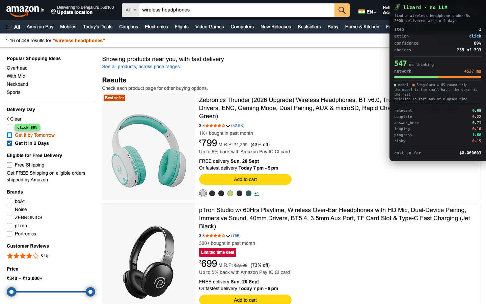

# 🦎 Lizard

**No cortex required.**

A browser agent driven by deterministic code and [Jev](https://typesafe.ai)
(TypeSafe's System One model) — with **zero LLM calls** in the loop.

Jev decides, code acts. Every decision Jev returns is an integer or an enum,
never text, so the action space is closed by construction: it cannot invent an
element that isn't on the page or emit a malformed selector.

```bash
uv sync && uv run playwright install chromium
cp .env.example .env          # add your TypeSafe key
uv run python scripts/run.py https://www.amazon.in \
  "find a wireless headphone under Rs 2000 delivered within 2 days"
```

```
1. type    searchbox "Search Amazon.in"                conf=0.90
2. scroll                                              conf=0.50
3. click   "Apply the filter Get It in 2 Days"         conf=0.73
4. click   "Zebronics Thunder (2026 Upgrade)"          conf=0.63
5. done                                                → new tab followed

verified: PASS — ₹749 is within the ₹2,000 limit
```

Nobody told it Amazon has a delivery filter. It read the page, found the
control that satisfied "within 2 days", and used it.



The HUD is injected as real DOM, so Playwright's own video capture records
it. Green box and tag mark the chosen element and its confidence; faint
dashed boxes mark everything it was allowed to choose from; the panel shows
the compute/network split and every signal from that single call.

## Status

- [x] Perception layer — page → prunable, typed action space
- [x] Jev client — pooled, typed answers
- [x] Decision loop — 7-question fan-out, deterministic guards
- [x] Deterministic constraints — prices and dates never touch the model
- [x] Trace logger — JSONL, one line per decision
- [x] Overlay / HUD — decisions painted onto the page, captured on video
- [x] Compute vs network split — measured, not estimated
- [x] Jev-selected search terms — fanned-out yes/no per candidate word
- [x] Extractive answers — the answer is located, never composed
- [x] CAPTCHA detection — stops, does not attempt to bypass

## Runs

```bash
uv run python scripts/run.py https://github.com/langchain-ai/langchain \
  "find the contributing guidelines document for this project"

uv run python scripts/run.py https://www.amazon.in \
  "find a wireless headphone under Rs 2000 delivered within 2 days"

# with the on-page HUD, recorded to video, holding 900ms per decision
uv run python scripts/run.py https://www.amazon.in "<task>" \
  --video videos --dwell 900

# race it against an LLM agent (needs ANTHROPIC_API_KEY)
uv run python scripts/race.py https://github.com/langchain-ai/langchain \
  "find the contributing guidelines document" --headed --video videos
```

## Perception benchmarks

Measured on live pages, 1440x900 viewport:

| site | elements | after dedupe | kept | named | tokens | $/call |
|---|---|---|---|---|---|---|
| GitHub repo | 200 | 182 | 182 | 100% | 2186 | $0.000092 |
| Python docs | 250 | 131 | 131 | 100% | 1833 | $0.000077 |
| Amazon search | 395 | 358 | 255 | 100% | 4628 | $0.000194 |
| HN front page | 230 | 183 | 183 | 83% | 2232 | $0.000094 |

A 30-step task costs roughly **$0.0034**.

```bash
uv run python scripts/probe_perception.py
```

## Where the time actually goes

The API's proxy returns `x-envoy-upstream-service-time`, so the split is
measured rather than inferred. One Amazon run, 5 steps, from Bengaluru:

| | ms | share |
|---|---|---|
| Jev compute | 576 | **4%** |
| Network (India ↔ US) | 1,708 | 13% |
| Page loads | 10,914 | **83%** |
| wall | 13,198 | |

Median compute per decision: **118 ms**.

The model is 4% of the run. Making it faster would change almost nothing —
the bottleneck left the model and became the internet. That is the whole
argument for a System One model in an agent loop.

## Measured latency (from India, Sept 2026)

TypeSafe claims 70–500ms. What I actually measured, and where it goes:

| | ms |
|---|---|
| DNS | 3 |
| TCP connect (1 RTT) | 251 |
| TLS handshake (+1 RTT) | 254 |
| request + compute + response | ~350 |
| **fresh connection per call** | **1066** |
| **pooled connection** | **349** |

One network round-trip to the US is ~250ms, so **model compute is ~100ms** —
consistent with TypeSafe's claim. The rest is the Indian Ocean.

**Reusing the TLS connection is a 3x win** (1066ms → 349ms) and is a single
line of client config. It is the difference between the model being faster
than a page load and slower than one.

### Extra questions are genuinely free

| questions | ms |
|---|---|
| 1 | 368 |
| 5 | 369 |
| 15 | 356 |

They evaluate in parallel, so there is no reason to ask one thing at a time.
Fan out everything you might need in a single call.


## The demo reel

```bash
uv run python scripts/demo.py              # all five, recorded to videos/
uv run python scripts/demo.py --only amazon --headed
```

| demo | steps | thinking | cost | result |
|---|---|---|---|---|
| amazon | 3 | 269 ms | $0.00077 | pTron Studio Pro — **₹799 verified against the ₹2000 limit** |
| pydocs | 7 | 691 ms | $0.00141 | `awaitable asyncio.gather(*aws, return_exceptions=False)` |
| github | 3 | 603 ms | $0.00075 | crossed to docs.langchain.com unprompted |
| wikipedia | 2 | 359 ms | $0.00096 | Kolkata Metro |
| pypi | 2 | 88 ms | $0.00010 | detected a bot challenge and stopped |

**The model is 3–5% of elapsed time in every run.** Page loads are the rest.

Each clip lands in `videos/<name>/` as a single `.webm`. The overlay is real
DOM, so Playwright's own capture records it — no screen recorder needed.

## Why the HUD shows two numbers

Each decision costs `compute + network`, and they are measured separately —
the API's proxy returns `x-envoy-upstream-service-time`, so the split is
read, not inferred.

| | typical |
|---|---|
| Jev compute | **~100 ms** |
| Bengaluru ↔ US round trip | **~250 ms** |

TypeSafe serves from the US and has no Indian PoP, so a call from here pays
a quarter-second of distance before the model does anything. That is physics,
not the model: the same call from a US host would be ~100 ms end to end.

Two consequences worth knowing:

- **Connection pooling is worth 3x.** A fresh TLS handshake costs two extra
  round trips. Unpooled, decisions took a measured 1066 ms; pooled, 349 ms.
  It is one line of client config and it is the difference between the model
  being faster than a page load and slower than one.
- **Fan-out is free, and so is a big action space.** 1 question 368 ms,
  15 questions 356 ms. A 5-option choice 63–116 ms of compute, a 255-option
  choice 81–127 ms. There is no reason to ask one thing at a time, and no
  reason to keep the action space small.

## What it cannot do

- **No vision.** Accessibility-tree only. Canvas-heavy or unlabelled sites defeat it.
- **No synthesis.** Answers are extracted spans, never composed prose.
- **Weak multi-hop reasoning.** There is no reasoner in the loop.
- **Query wording is the soft spot.** Search terms are *selected* from the
  user's own words by a fanned-out yes/no per word — never generated. It
  handles "which words name the thing" well; it is not a query writer.
- **Bot challenges end the run.** By design — PyPI's search is behind one,
  and the agent stops rather than attempting to get past it.

## Confidence is load-bearing

The signals are not decoration. `done` is a *claim*, and a hesitant one gets
rejected: on Amazon the agent first called the task complete while still on
the search-results page, with `complete` at 0.43. The loop pushed it one
level deeper, onto the product page, where the price could actually be
checked. Ungated, that run would have "succeeded" without ever verifying
the constraint it was given.
